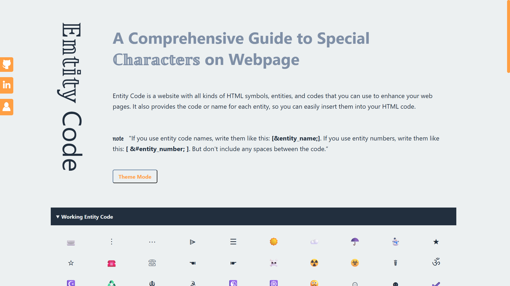

# Entity Code  

_Entity Code is a comprehensive guide to special characters on web pages. It allows developers and learners to quickly find, copy, and use HTML entities, making content more accessible and professional._  

  

  
  

---

## ⚠️ Legal Notice  

> © 2025 Mayank – **All Rights Reserved**  
>
> 🚫 Unauthorized use, duplication, redistribution, or modification of this project is **strictly prohibited**.  
>
> 🛑 Any infringement will be considered a **legal violation** and may lead to civil, financial, or criminal consequences.  
>
> ✅ This project is shared only for **educational and personal learning purposes**. Please respect the creativity and intellectual property behind it.  

---