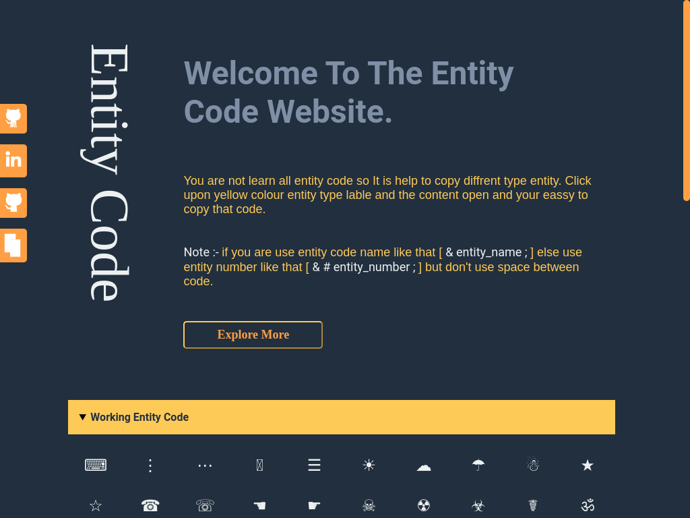

# title

- Name : "Entity Code"

- Description : "give code of entity code that you are use in webpage"

- Version : 8.3

- Update : 30-05-2023

- Status : Reset

- Responsive : Ture

- TecStack : { HTML | CSS | JavaScript }

- Thanks : { VSCode | GitHub }

- Work : Self Group

- Design : { Mayank }

- Developer : { Mayank }

- CopyRight : { Mayank }

- URL : https://mayankdevil.github.io/website-8/

- Clone : https://github.com/MayankDevil/website-8.git

- Download : https://github.com/MayankDevil/website-8/archive/refs/heads/main.zip

---

#### Home Page

### Responsive

**Breakpoints** { 375 | 576 | 768 | 992 }

### Theme

_Dark Theme with Orange | Yellow | Gray - White give very nice look to website_

### PreLoader

_it website add pre loader that loader before and it create by code not image_
